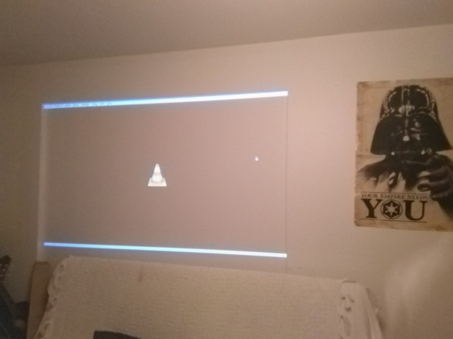

# screen_obstructor
Displays 'always on top' rectangles at specified coordinates to hide some portions of the screen. Can be useful for hiding the UI and the desktop when doing a windowed projection.

Images speak better than words, so here is a real example :


Projection before using obstructor


Projection after using obstructor, the UI is hidden. With other params, all the VLC UI would have been hidden too

## Instalation

* Clone or download this repository
```
    $ git@github.com:mancelin/screen_obstructor.git
```
* Install Tkinter for Python 3
```
sudo apt-get install python3-tk
```
* Install the dependencies from the requirements.txt file
```
pip install -r requirements.txt
```

## Use - obstructor

```
usage: obstructor.py [-h] w h x y wv hv

positional arguments:
  w           width of screen
  h           height of screen
  x           x of visble
  y           y of visble
  wv          width of visble
  hv          height of visble

optional arguments:
  -h, --help  show this help message and exit
```

## Issues
For now, you can't quit the obstructor simply by pressing <kbd>Esc</kbd>.

For quitting the obstructor, go back to the terminal you lauched it from, press <kbd>Ctrl</kbd> + <kbd>C</kbd> then over the black zone of the obstructor, it will stop the program.

## Licence
GNU GENERAL PUBLIC LICENSE
